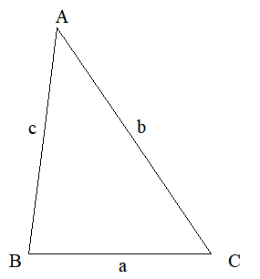
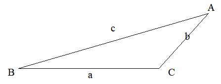

# Draw ANY Triangle from three properties

> You will need to use the math module for this program. [Click Here](../math-library/) for a guide.
>
> Also, don't worry about copy-pasting all of the code you see. Everything you see is in [code.py](code.py)

After studying Trigonometry, you should know that you can find one angle of a triangle if you know the lengths all three sides, or if you know the lengths of two sides and the size of the angle between them, you can find the length of the remaining side. This uses Cosine Rule.

Also, if you know the lengths of two sides and the size of an angle opposite to one of those sides, you can find the size of the angle opposite to the other size and vice versa. This is Sine Rule.

So, let's create a couple of problems, have a go if you're bored:

> 1. A triangle has sides of lengths *4cm*, *5cm* and *6cm*. Find the sizes of all three of its angles and hence sketch it.
   
> 2. A triangle has sides of lengths *3cm* and *8cm*. The angle between these lines is of size *32°*. Find the length of the remaining side, the sizes other two angles and hence sketch the triangle.

And, here are the solutions, with an accuracy of 2 decimal places:

> Sides: *a = 4cm, b = 6cm, c = 5cm*
> 
> Angles: *A = 41.41°, B = 82.82°, C = 55.77°*
>
> 

> Sides: *a = 284.14cm, b = 150.00cm, c = 400.00cm*
>
> Angles: *A = 32.00°, B = 16.25°, C = 131.75°*
>
> 

Now, you may think these were actual exam questions I pulled off the internet, but no, I made these on the spot. And I made the sketches in Turtle!

## Finding all the sides and angles

Regardless of whether we know three sides or two and the angle between, we know three properties and either way, we have to use cosine rule. Below are implementations of both versions of it in Python.

```Python
# Note: cos works in radians, so we have to convert.
# a, b, c are sides and A, B, C are angles.

def cosFromThreeSides(a, b, c):
    A = (b**2) + (c**2) - (a**2)
    A = A / (2 * b * c)
    A = math.acos(A)
    return math.degrees(A)

def cosFromTwoSideAndAngleBetween(b, c, A):
    ARad = math.radians(A)
    a2 = (b**2) + (c**2) - (2 * b * c * math.cos(ARad))
    return math.sqrt(a2)
```

Once we put the relevant data into one of these functions, we then have three sides and an angle. We now have two angles to find. With this data, we can use the sine rule to find one of these angles, since we know at least two sides and one angle. Now let's implement sine rule into Python.

```Python
def sinForAngle(A, a, b):
    ARad = radians(A)
    sinAOvera = sin(ARad) / a
    BSin = sinAOvera * b
    BRad = asin(BSin)
    return degrees(BRad)
```

Now there's one more angle to work out. No, you don't need to use sine rule again, instead you only need to do some subtraction. Remember that the sum of all angles in any triangle *180°*, and since we know two of three angles, you can just take *180°* and take away the values of the two angles. And it works like this:

```Python
def remainingAngle(A, B):
    return 180 - A - B
```

Very. Very. Simple. And just like that, we know all of the lengths of the sides, and all of the sizes of the angles of the triangle we're working on! And to really seal the deal, let's create a couple of encompassing functions that do everything.

```Python
def propertiesFromThreeSides(a, b, c):
    A = cosFromThreeSides(a, b, c)
    B = sinForAngle(A, a, b)
    C = remainingAngle(A, B)
    return (a, b, c, A, B, C)

def propertiesFromTwoSidesAndAngleBetween(b, c, A):
    a = cosFromTwoSideAndAngleBetween(b, c, A)
    B = sinForAngle(A, a, b)
    C = remainingAngle(A, B)
    return (a, b, c, A, B, C)
```

## Finding out even more

Since, we now know everything about the triangle we are working out, we can use any triangle-related equation to find more information. In this case, let's create a simple function to find the area.

```Python
def areaOfTriangle(a, b, C):
    CRad = radians(C)
    return 0.5 * a * b * sin(CRad)
```

Pretty good if you happen to be painting a wall that's shaped like a scalene triangle and you're trying to figure out how much paint to buy.

Let's make a subroutine to display everything we know too.

```Python
def showProperties(a, b, c, A, B, C, area):
    print(f"Sides: a = {a:.2f}cm, b = {b:.2f}cm, c = {c:.2f}cm")
    print(f"Angles: A = {A:.2f}°, B = {B:.2f}°, C = {C:.2f}°")
    print(f"Area = {area:.2f}cm²")
```

## Sketching with Turtle

This part is more so for fun. Not in coding the solution, but seeing triangles take shape. Don't believe me? Look at this code...

```Python
def drawTriangle(a, b, c, A, B, C):
    import turtle as t

    t.hideturtle()

    t.penup()
    t.goto(-20, -20)
    t.write("B", False, align="left", font=("Times New Roman", 16, "normal"))
    t.goto(0,0)
    t.pendown()

    t.fd(a/2)
    t.penup()
    t.goto(a/2, -25)
    t.write("a", False, align="left", font=("Times New Roman", 16, "normal"))
    t.goto(a/2, 0)
    t.pendown()
    t.fd(a/2)
    t.lt(180 - C)

    t.penup()
    t.goto(a+20, -20)
    t.write("C", False, align="left", font=("Times New Roman", 16, "normal"))
    t.goto(a,0)
    t.pendown()

    t.fd(b/2)
    t.penup()
    t.rt(90)
    t.fd(5)
    t.write("b", False, align="left", font=("Times New Roman", 16, "normal"))
    t.bk(5)
    t.lt(90)
    t.pendown()
    t.fd(b/2)
    t.lt(180 - A)
    t.write("A", False, align="left", font=("Times New Roman", 16, "normal"))

    t.fd(c/2)
    t.penup()
    t.rt(90)
    t.fd(15)
    t.write("c", False, align="left", font=("Times New Roman", 16, "normal"))
    t.bk(15)
    t.lt(90)
    t.pendown()
    t.fd(c/2)
    t.lt(180 - B)

    t.mainloop()
```

Yeah... I don't like working with Turtle particularly much. But let me explain what this does. Given all the angles and sides of the triangle, this code draws the triangle resulting from the data, and labels all of the sides and angles. Using this with the above `showProperties` subroutine, the triangle is accurately drawn and described.
